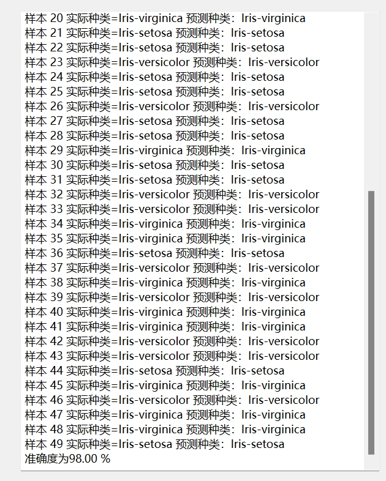
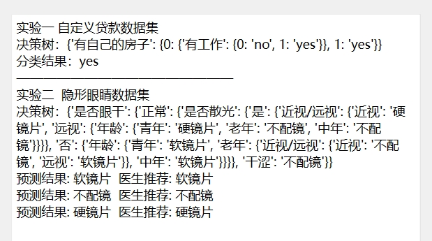
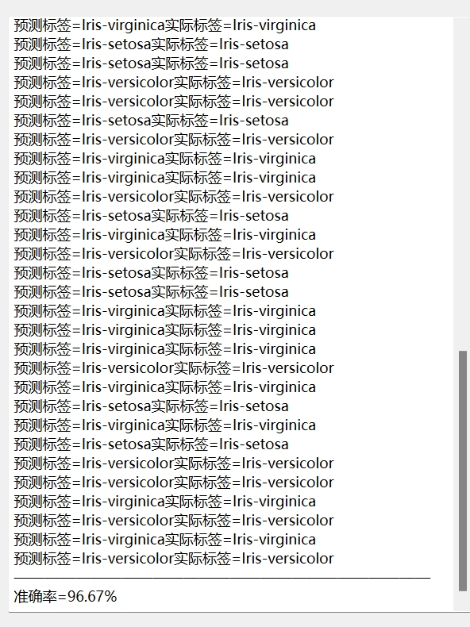
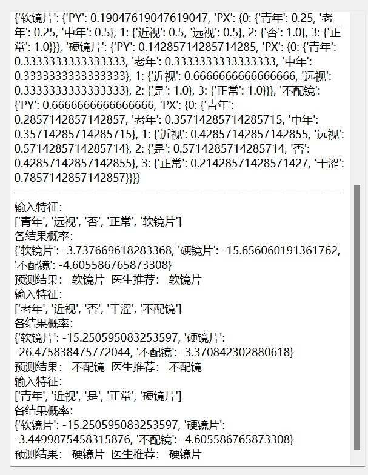
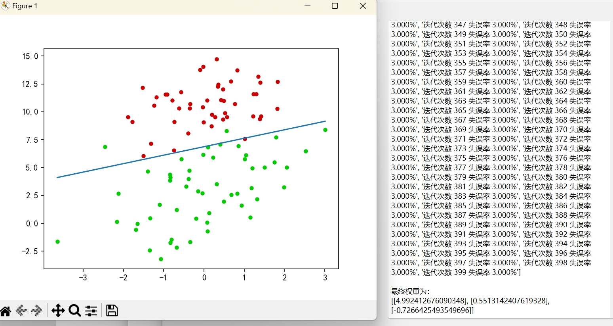

# Python人工智能算法学习记录
视频教程：[python与人工智能](https://www.bilibili.com/video/BV1KZ4y1c7Eb/)
## 1.常用库/包基础功能练习
### 1.1Matplotlib
[matplotlib_learn](https://github.com/Cakeeeeey/Algorithm-Learning-Notes/tree/main/%E4%BA%BA%E5%B7%A5%E6%99%BA%E8%83%BD_%E7%AE%97%E6%B3%95%E7%AF%87_%E6%95%99%E7%A8%8B%E4%BD%9C%E4%B8%9A/matplotlib_learn)
### 1.2Numpy
[numpy_learn](https://github.com/Cakeeeeey/Algorithm-Learning-Notes/tree/main/%E4%BA%BA%E5%B7%A5%E6%99%BA%E8%83%BD_%E7%AE%97%E6%B3%95%E7%AF%87_%E6%95%99%E7%A8%8B%E4%BD%9C%E4%B8%9A/numpy_learn)
### 1.3PyQt6
[A_Simple_Sample](https://github.com/Cakeeeeey/Algorithm-Learning-Notes/tree/main/PyQT6_%E6%95%99%E7%A8%8B%E4%BD%9C%E4%B8%9A/A_Simple_Sample)
## 2.机器学习算法练习
代码与数据：[Algorithm](https://github.com/Cakeeeeey/Algorithm-Learning-Notes/tree/main/%E4%BA%BA%E5%B7%A5%E6%99%BA%E8%83%BD_%E7%AE%97%E6%B3%95%E7%AF%87_%E6%95%99%E7%A8%8B%E4%BD%9C%E4%B8%9A/Algorithm)
### 2.1KNN

### 2.2DecisionTree

### 2.3CartTree

### 2.4Bayes

### 2.5LogisticRegression

